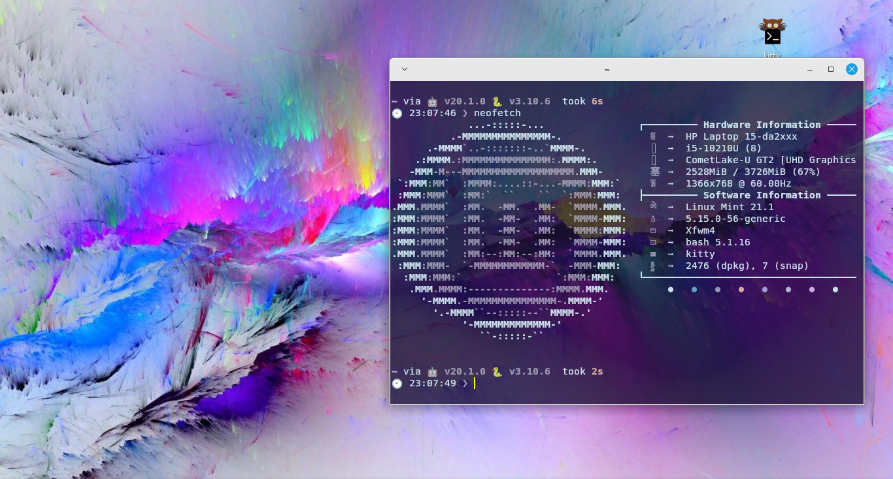

# My dotfiles
Currently I am on **Linux Mint Xfce 21.1** and these are my dotfiles

### To setup on your machine 
**WARNING:** Will remove your exisiting dotfiles if you run the `setup.sh`

Just do:
```bash
git clone https://github.com/Sengolda/dotfiles && cd dotfiles && sudo bash setup.sh
```

To configure git email and username do:
```bash
git config --global user.name [your username]
git config --global user.email [your email]
```

Then just set your wallpaper to the one in [wallpapers](wallpapers/vibrant-05.jpg)

To use git and github you need to setup ssh keys read how to do that [here](https://www.freecodecamp.org/news/git-ssh-how-to/)


### Screenshots

